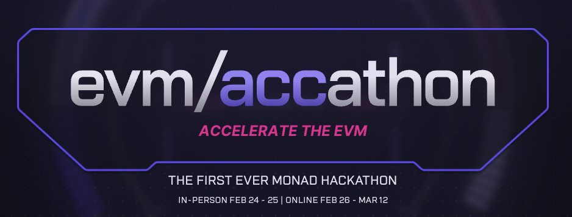

# Gorillionaire

## Overview

**Gorillionaire** is an advanced signal protocol designed to provide real-time trading insights by aggregating and processing multi-source data. It enables AI agents and traders to make informed decisions in the fast-moving cryptocurrency market.

By integrating price feeds, historical on-chain data, whale/developer activity, new token launches, and social sentiment (Twitter/Discord), Gorillionaire generates actionable signals. These signals are streamed to users via multiple channels, including Telegram, Discord, Twitter, and, in the future, Farcaster and Lens.

## Deployment on Monad Testnet

Gorillionaire is being developed and tested on the **Monad Testnet**, launching on Monad to introduce a new way to integrate AI Agents faster and more reliably. This enables high-speed, low-latency execution and enhances the scalability of AI-powered trading strategies.

## Participation in EVM/Accathon

We are excited to announce our participation in the **EVM/Accathon**, where we are showcasing Gorillionaire’s capabilities in AI-driven trading. Our goal is to push the boundaries of AI-integrated crypto trading and establish new industry standards.



## Features

### Multi-Source Data Aggregation

- **📊 Price Feeds** – Collects data from multiple sources to ensure accurate market insights.
- **⛓ Historical On-Chain Data** – Analyzes past blockchain transactions to detect trends and anomalies.
- **🐋 Whale & Developer Activity** – Monitors large transactions and development patterns.
- **🚀 New Token Launches** – Identifies and tracks newly launched tokens.
- **🗣 Social Sentiment Analysis** – Evaluates Twitter and Discord discussions to gauge market sentiment.

### Real-Time Signal Processing & Delivery

- **📡 Live Signal Websocket** – Clients can subscribe to a real-time signal feed for instant updates.
- **🔗 Multi-Channel Distribution** – Insights are shared across Telegram, Discord, Twitter, and upcoming decentralized social platforms.
- **🤖 AI-Ready Signals** – Trading AI agents can integrate Gorillionaire’s insights to enhance decision-making.

## Agent-Based Architecture

Gorillionaire operates through a layered agent system, with each level specializing in a specific function:

### **Level 1: Data Extraction Agents**

This level is responsible for gathering raw data from various sources. It includes:

- **📡 Price Detector** – Aggregates price data from multiple feeds.
- **🐋 Whale Detector** – Monitors large transactions and whale movements.
- **🚀 Token Launch Detector** – Identifies new token deployments.
- **🗣 Social Activity Detector** – Analyzes Twitter and Discord discussions.
- **📜 General Activity Detector** – Tracks blockchain activity for relevant patterns.

### **Level 2: Signal Generation Agents**

This level processes data from Level 1 and generates actionable signals. It currently includes:

- **🔥 DEGEN NAD** – High-risk, high-reward trading signals.
- **⚡ AGGRESSIVE NAD** – Balanced strategy with a strong focus on rapid opportunities.
- **📈 VALUE INVESTOR NAD** – Long-term investment insights based on fundamental value.

These agents provide refined insights that other AI agents or human traders can use to make decisions. When transmitting signals, additional metadata is included to support further refinement and validation by external models or decision-makers.

## How It Works

1. **Data Collection** – Level 1 agents continuously extract information from multiple sources.
2. **Processing & Signal Generation** – Level 2 agents analyze data and produce actionable insights.
3. **Distribution & Subscription** – Users and AI agents subscribe to the websocket to receive live trading signals.
4. **Decision-Making Support** – External AI trading bots or traders leverage signals for enhanced decision-making.

## Getting Started

To start using Gorillionaire, set up the necessary dependencies and run the system with the following command:

```sh
pnpm clean && pnpm install --no-frozen-lockfile && pnpm run build && pnpm start --characters="./characters/gorillionaire.character.json"
```

## Future Roadmap

- **📢 Integration with Farcaster & Lens** – Expanding social sentiment tracking.
- **🔬 More Advanced AI Models** – Enhancing predictive capabilities.
- **🛠 Developer API** – Enabling external agents to interact seamlessly with Gorillionaire.

---

With Gorillionaire, trading AI development becomes faster, easier, and more customizable, making it the go-to protocol for crypto traders looking for cutting-edge market intelligence.
