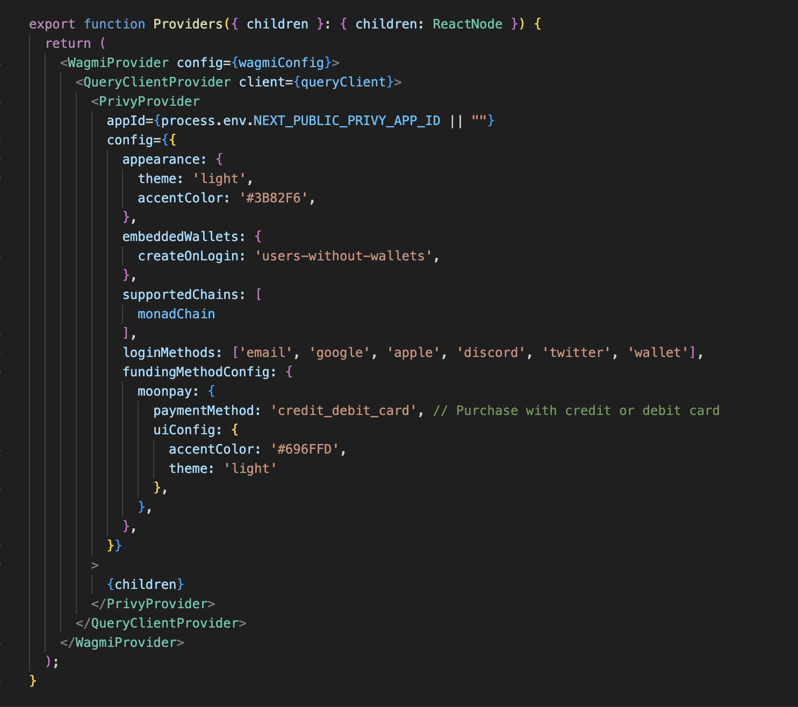
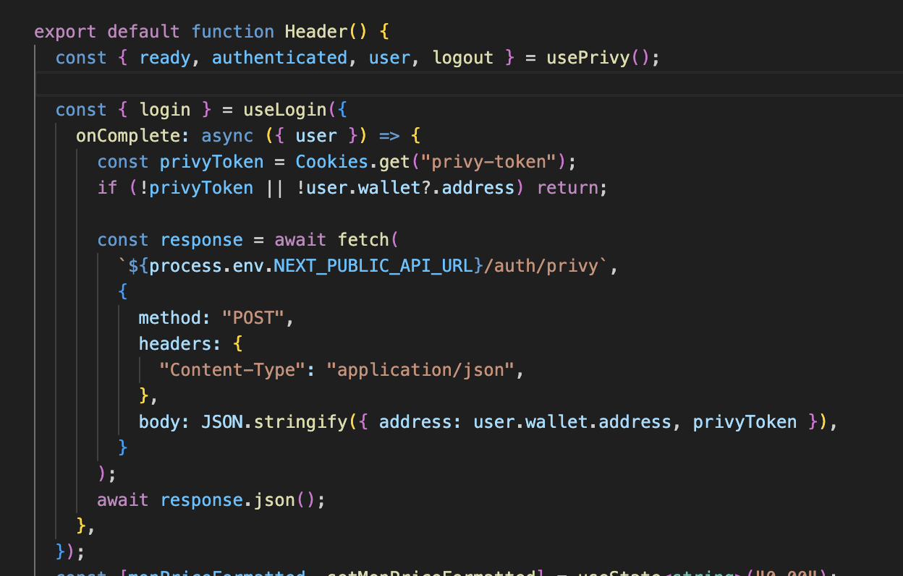
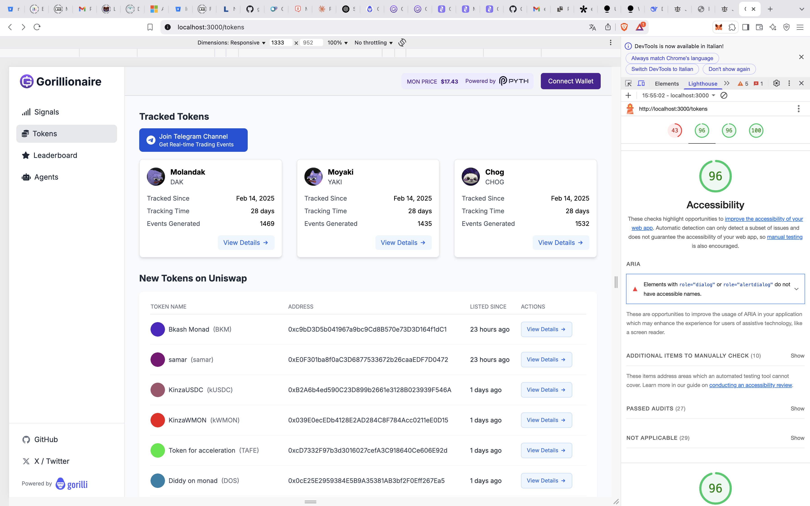
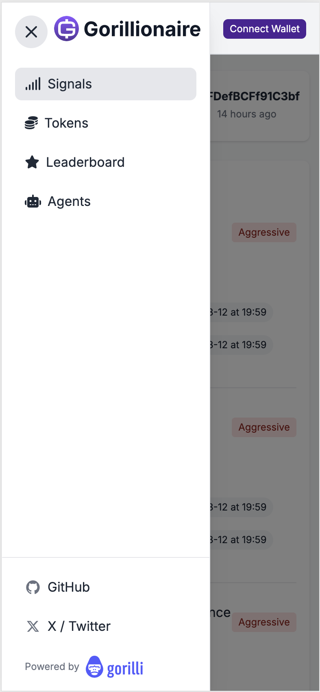
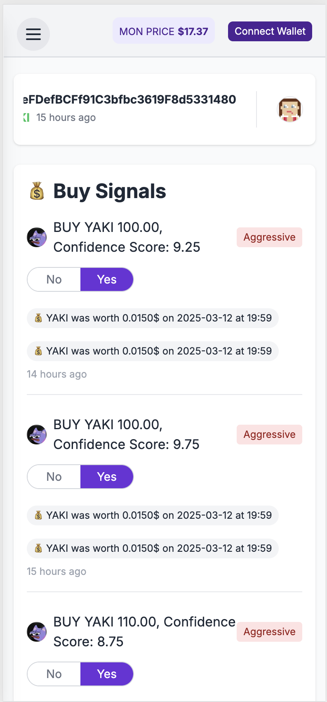
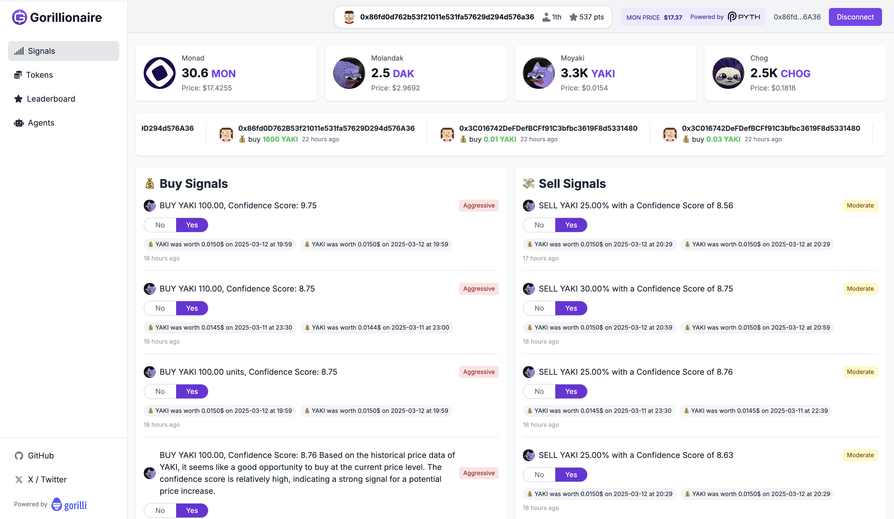

# Frontend

## Overview

We put strong emphasis on delivering an intuitive and accessible user experience with **Gorillionaire**, ensuring users of all backgrounds — from DeFi veterans to first-time traders — can navigate and use the platform effortlessly. The interface is clean, consistent, and easy to navigate. We followed UX best practices to ensure users can quickly understand where to go and what to do, with a clear and logical structure across all screens. Every interaction in **Gorillionaire** is designed to be simple and accessible, even for users unfamiliar with crypto trading or blockchain technologies. Features are easy to find, actions are straightforward, and the overall flow is smooth and frictionless.
We believe that a great user experience is key to onboarding more people into decentralized finance. By focusing on design, accessibility, and responsiveness, **Gorillionaire** offers a seamless and inclusive experience that leverages the performance power of **Monad**.
The UI has a modern and engaging visual design — with a harmonious color palette, smooth transitions, and thoughtfully crafted components. The platform is not only functional but also aesthetically pleasing, making it enjoyable to use.

## How to run the project locally

1- Install the dependencies
```
cd frontend
yarn
```

2- Clone the .env.example and add all the variables listed
```
mv .env.example .env
```


3- Run the development server:

```bash
yarn dev
```

4- Open: [http://localhost:3000](http://localhost:3000) with your browser to see the result.


### ✅ Wallet Connection with Privy
Gorillionaire leverages Privy's advanced authentication infrastructure to provide a seamless and secure wallet connection experience. Our integration supports:

Multiple login methods: Email, Google, Apple, Discord, Twitter, and Web3 wallets
Embedded wallet creation for users without existing crypto wallets
Simplified onboarding with flexible authentication options

While currently integrated with the Monad testnet, our Privy setup prepares the groundwork for future financial integrations. The configuration includes preliminary MoonPay funding support, though full cryptocurrency purchasing features are not yet activated in the testnet environment.

<div style="display: flex; justify-content: center; gap: 10px;">
  <div style="width: 50%;">
    
  </div>
  <div style="width: 50%;">
    
  </div>
</div>

### ✅ Accessibility  
We’ve paid attention to accessibility standards to make **Gorillionaire** inclusive for everyone:
- High-contrast color schemes for better visibility and readability.
- Clear visual hierarchy and semantic structure.
- Keyboard navigation and screen reader compatibility for users with motor or visual impairments.

We leveraged Google Lighthouse, a powerful web auditing tool, to rigorously assess and optimize our platform's accessibility. Our meticulous approach has yielded impressive results, with accessibility scores consistently ranging between 92% and 96% across both desktop and mobile platforms. This achievement underscores our commitment to creating an inclusive digital experience that ensures usability for all users, regardless of their abilities or the device they're using.

<div style="width: 100%;">
    
</div>


### ✅ Responsiveness  
**Gorillionaire** was meticulously designed with a mobile-first and adaptive approach. Our development focused on creating a seamless user experience across various devices and screen sizes.

Key responsive design features include:
- Adaptive layout that dynamically adjusts to different screen sizes.
- Hamburger menu for mobile navigation, ensuring intuitive interaction on smaller screens.
- Flexible grid systems and responsive components.
- Touch-friendly interfaces for mobile devices.
- Optimized performance across desktop and smartphone platforms.

<br>

Signal Section Mobile:
<div style="display: flex; justify-content: center; gap: 10px;">
  <div style="width: 50%;">
    
  </div>
  <div style="width: 50%;">
    
  </div>
</div>
<br>
Signals Section Desktop:
<div style="padding-top:10px;">
  <div style="width: 100%;">
    
  </div>
</div>
