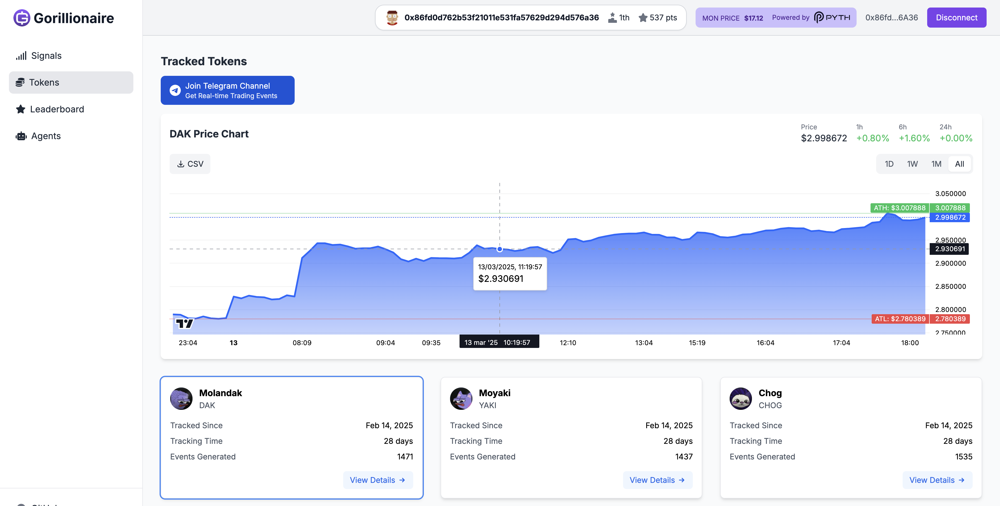

# Gorillionaire Frontend

## Overview

We put strong emphasis on delivering an intuitive and accessible user experience with **Gorillionaire**, ensuring users of all backgrounds, from DeFi veterans to first-time traders, can navigate and use the platform effortlessly. The interface is clean, consistent, and easy to navigate. **Gorillionaire** offers a seamless and inclusive experience that leverages the performance power of **Monad**.

## How to run the project locally

1- Install the dependencies
```
cd frontend
yarn
```

2- Clone the .env.example and add all the variables listed
```
mv .env.example .env
```

```
NEXT_PUBLIC_PRIVY_APP_ID=
NEXT_PUBLIC_NILLION_SCHEMA_ID=
NEXT_PUBLIC_API_URL=
```


3- Run the development server:

```bash
yarn dev
```

4- Open: [http://localhost:3000](http://localhost:3000) with your browser to see the result.


### ✅ Privy Integration

**Gorillionaire** leverages Privy's advanced authentication infrastructure to provide a seamless and secure wallet connection experience. Our integration supports:

- Multiple login methods: Email, Google, Apple, Discord, Twitter, and Web3 wallets.
- Embedded wallet creation for users without existing crypto wallets.
- Simplified onboarding with flexible authentication options.

While currently integrated with the Monad testnet, our Privy setup prepares the groundwork for future financial integrations. The configuration includes preliminary MoonPay funding support, though full cryptocurrency purchasing features are not yet activated in the testnet environment.

To implement Privy authentication, we followed a straightforward setup process:

- Create an account at Privy Dashboard
- Create a new project within the Privy platform
- Customize wallet settings and authentication methods
- Configure login preferences
- Monitor user access and authentication logs

The integration requires importing the Privy App ID into the project configuration (see env.example):
NEXT_PUBLIC_PRIVY_APP_ID=

<div style="display: flex; justify-content: center; gap: 10px;">
  <div style="width: 50%;">
    
  </div>
  <div style="width: 50%;">
    
  </div>
</div>

### ✅ TradingView Lightweight Charts

**Gorillionaire** leverages **TradingView Lightweight Charts** to deliver professional-grade trading visualization with minimal overhead. This powerful charting solution provides smooth, real-time monitoring of token prices and market trends.

Key Features

- Interactive Time Range Selection**: Easily switch between 1D, 1W, 1M, and All-time views
- Real-time Price Statistics**: Monitor current price and percentage changes (1h, 6h, 24h)
- All-Time High/Low Markers**: Instantly visualize important price thresholds
- Interactive Tooltips**: Hover over the chart to see precise price data and timestamps
- Data Export**: Download historical price data as CSV for further analysis

<div style="width: 100%;">
    
</div>

### ✅ Accessibility  
We’ve paid attention to accessibility standards to make **Gorillionaire** inclusive for everyone:
- High-contrast color schemes for better visibility and readability.
- Clear visual hierarchy and semantic structure.
- Keyboard navigation and screen reader compatibility for users with motor or visual impairments.

We leveraged Google Lighthouse, a powerful web auditing tool, to rigorously assess and optimize our platform's accessibility. Our meticulous approach has yielded impressive results, with accessibility scores consistently ranging between 92% and 96% across both desktop and mobile platforms. This achievement underscores our commitment to creating an inclusive digital experience that ensures usability for all users, regardless of their abilities or the device they're using.

<div style="width: 100%;">
    
</div>


### ✅ Responsiveness  
**Gorillionaire** was meticulously designed with a mobile-first and adaptive approach. Our development focused on creating a seamless user experience across various devices and screen sizes.

Key responsive design features include:
- Adaptive layout that dynamically adjusts to different screen sizes.
- Hamburger menu for mobile navigation, ensuring intuitive interaction on smaller screens.
- Flexible grid systems and responsive components.
- Touch-friendly interfaces for mobile devices.
- Optimized performance across desktop and smartphone platforms.

<br>

Signal Section Mobile:
<div style="display: flex; justify-content: center; gap: 10px;">
  <div style="width: 50%;">
    
  </div>
  <div style="width: 50%;">
    
  </div>
</div>
<br>
Signals Section Desktop:
<div style="padding-top:10px;">
  <div style="width: 100%;">
    
  </div>
</div>
